# [IRMP](https://github.com/ukw100/IRMP) - Infrared Multi Protocol Decoder + Encoder
Available as Arduino library "IRMP"

### [Version 3.3.6](https://github.com/ukw100/IRMP/releases) - work in progress

[](https://www.gnu.org/licenses/gpl-3.0)
[](https://www.ardu-badge.com/IRMP)
[](https://github.com/ukw100/irmp/commits/master)
[](https://github.com/ukw100/irmp/actions)
[](https://github.com/brentvollebregt/hit-counter)

## 50 IR protocols supported and low memory footprint
- Only 39 protocols can be enabled for receive at the same time, because some of them are quite similar and conflicts with each other.
- 39 protocols are available for send.
- FLASH usage in bytes: 1500 for one protocol, 4300 for 15 main and 8000 for all 39 protocols.
- RAM usage in bytes: 52, 73 and 100.

| Nano running AllProtocol example | YouTube Video | Instructable |
|-|-|-|
| 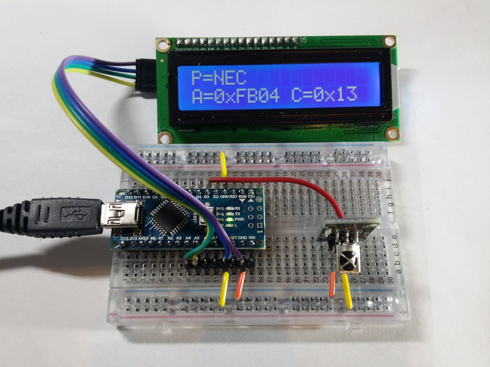 | 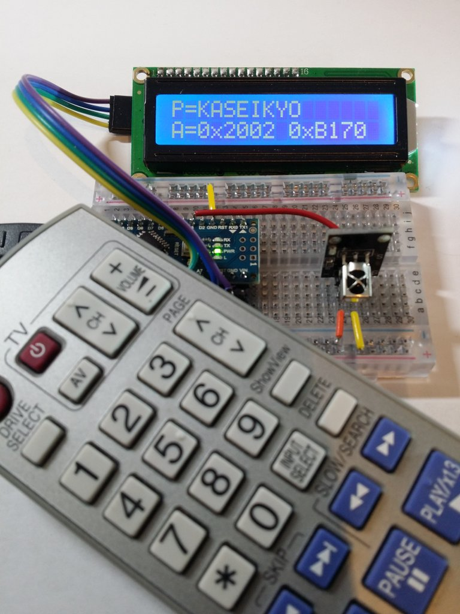 | [](https://www.instructables.com/id/IR-Remote-Analyzer-Receiver-With-Arduino) |
 
# List of protocols
- Sony SIRCS, NEC + APPLE + ONKYO, Samsung + Samsg32, Kaseikyo
- JVC, NEC16, NEC42, Matsushita, DENON, Sharp, RC5, RC6 & RC6A, IR60 (SDA2008) Grundig, Siemens Gigaset, Nokia
- BOSE, Kathrein, NUBERT, FAN (ventilator), SPEAKER (~NUBERT), Bang & Olufsen, RECS80 (SAA3004), RECS80EXT (SAA3008), Thomson, NIKON camera, Netbox keyboard, ORTEK (Hama), Telefunken 1560, FDC3402 keyboard, RC Car, iRobot Roomba, RUWIDO, T-Home, A1 TV BOX, LEGO Power RC, RCMM 12,24, or 32, LG Air Condition, Samsung48, Merlin, Pentax, S100, ACP24, TECHNICS, PANASONIC Beamer, Mitsubishi Aircond, VINCENT, SAMSUNG AH, GREE CLIMATE, RCII T+A, RADIO e.g. TEVION, METZ<br/>
- **NEC, Kaseiko, Denon, RC6, Samsung + Samsg32 were successfully tested in interrupt mode.**

# Features
- You may use **every pin for input or output**.
- Interrupt mode for major protocols.
- Callback after successful receive of a command supported.
- Inverted feedback LED for send and receive feedback supported.
- Inverted IR output for LED connected to VCC supported.
- Unmodulated IR signal output enables direct replacment of an IR receiver circuit.
- Compatible with Arduino tone library.

# Minimal version
For applications only requiring NEC protocol, there is a receiver which has very **small codesize and does NOT require any timer**. See the MinimalReceiver and IRDispatcherDemo example how to use it.

# Schematic for Arduino UNO
The VS1838B is used as receiver for all examples and tests. This module has a 120 µs on/low and a 100 µs off/high delay between received signal and output. So it shortens the mark and extends the space by 20 µs.
| IR-Receiver connection | Serial LCD connection |
|---|---|
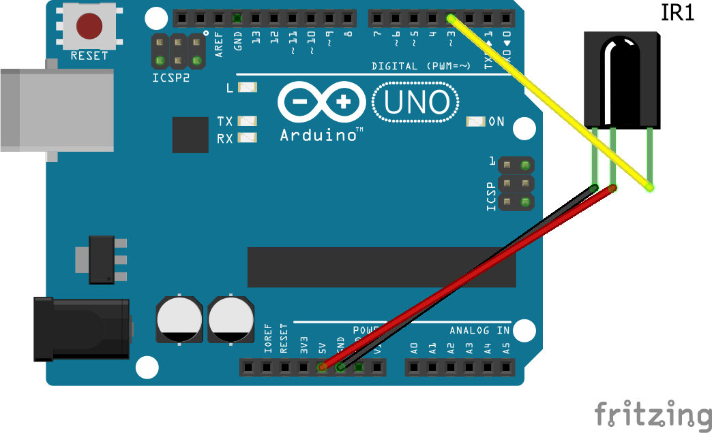 | 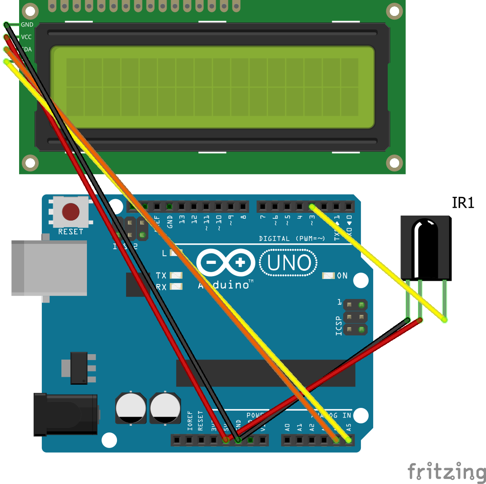

# Supported Arduino architectures / CPU's / boards
| Architecture | CPU | Board |
|-|-|-|
| avr     | ATmega16, ATmega328P, ATmega32U4, ATtinyX5, ATtinyX7 | Uno, Nano, Leonardo, Sparkfun Pro Micro, Digispark etc. |
| megaavr | ATmega4809 | Uno WiFi Rev 2, Nano Every |
| samd    | SAMD21G18A | Zero, MKR1000, etc. |
| esp8266 | % | all |
| esp32   | % | all |
| stm32   | STM32F1xx     | BluePill |
| STM32F1 | STM32F1xx     | BluePill |
| apollo3 | Ambiq Apollo3 | Sparkfun Apollo3 + Artemis |
| mbed    | nRF528x       | Nano 33 BLE |
| Teensiduino | all       | >= Teensy 3 |

# Quick comparison of 4 Arduino IR receiving libraries
## This is a short comparison and may not be complete or correct
I created this comparison matrix for [myself](https://github.com/ArminJo) in order to choose a small IR lib for my project and to have a quick overview, when to choose which library.<br/>
It is dated from **11.11.2020**. If you have complains about the data or request for extensions, please send a PM or open an issue.

| Subject | [IRMP](https://github.com/ukw100/IRMP) | [IRLremote](https://github.com/NicoHood/IRLremote) | [IRLib2](https://github.com/cyborg5/IRLib2)<br/>**mostly unmaintained** | [IRremote](https://github.com/z3t0/Arduino-IRremote) |
|---------|------|-----------|--------|----------|
| Number of protocols | **50** | Nec + Panasonic + Hash \* | 12 + Hash \* | 16 |
| 3.Party libs needed| % | PinChangeInterrupt if not pin 2 or 3 | % | % |
| Timing method receive | Timer2 or interrupt for pin 2 or 3 | **Interrupt** | Timer2 or interrupt for pin 2 or 3 | Timer2 |
| Timing method send | Timer2 interrupts | Timer2 interrupts | Timer2 and blocking wait | ? |
| Send pins| All | All | All ? | ? |
| Decode method | OnTheFly | OnTheFly | RAM | RAM |
| Encode method | OnTheFly | OnTheFly | OnTheFly | OnTheFly or RAM |
| Callback suppport | x | % | % | % |
| Repeat detection | Receive + Send | % | ? | Sporadic |
| LED feedback | x | % | x | x |
| FLASH usage (simple NEC example with 5 prints) | 1500<br/>(4300 for 15 main / 8000 for all 40 protocols)<br/>(+200 for callback)<br/>
(+80 for interrupt at pin 2+3)| **1270**<br/>(1400 for pin 2+3) | 4830 | 3210 |
| RAM usage | **52**<br/>(73 / 100 for 15 (main) / 40 protocols) | **62** | 334 | 227 |
| Supported platforms | **avr, megaAVR, attiny, Digispark (Pro), esp8266, ESP32, STM32, SAMD 21, Apollo3<br/>(plus arm and pic for non Arduino IDE)** | avr, esp8266 | avr, SAMD 21, SAMD 51 | avr, attiny, [esp8266](https://github.com/crankyoldgit/IRremoteESP8266), esp32, SAM, SAMD |
| Last library update | 4/2020 | 4/2018 | 9/2019 | 11/2017 |
| Remarks | Decodes 40 protocols concurrently.<br/>39 Protocols to send.<br/>Work in progress. | Only one protocol at a time. | Consists of 5 libraries. **Project containing bugs - 45 issues, no reaction for at least one year.** | Decoding is very basic and easy to extend. |

\* The Hash protocol gives you a hash as code, which may be sufficient to distinguish your keys on the remote, but may not work with some protocols like Mitsubishi

# Pin usage
You may use **every pin for input or output**, just define it like `#define IRMP_INPUT_PIN 3` and `#define IRSND_OUTPUT_PIN 4`. The PWM of the output pin is generated by software bit banging.

# Dynamic pins numbers
If you want to use pin numbers for input, output and LED feedback specified at runtime, you must define `IRMP_IRSND_ALLOW_DYNAMIC_PINS`. See [ReceiveAndSendDynamicPins example](examples/ReceiveAndSendDynamicPins/ReceiveAndSendDynamicPins.ino).<br/>
The `irmp_init` and `irsnd_init` function then allows up to 3 parameters `uint_fast8_t aIrmpInputPin/aIrsndOutputPin, uint_fast8_t aIrmpFeedbackLedPin, bool aIrmpLedFeedbackPinIsActiveLow`.<br/>
Be aware, only one pin and enable flag for receive and send feedback LED is supported.

# Receiving and sending simultaneously
Receiving and sending is possible with this library, but since we use only 1 timer, receiving is inhibited while sending the IR signal.<br/>
Sending the IR signal starts with saving current timer configuration, setting the timer to the send configuration / frequency, sending the signal (and waiting for the gap after the signal) and then automatically reset the timer to its previous (receiving) configuration.

# API
### IRMP

```
// Init functions
void irmp_init (void);
void irmp_init(uint_fast8_t aIrmpInputPin);
void irmp_init(uint_fast8_t aIrmpInputPin, uint_fast8_t aIrmpFeedbackLedPin);
void irmp_init(uint_fast8_t aIrmpInputPin, uint_fast8_t aIrmpFeedbackLedPin, bool aIrmpLedFeedbackPinIsActiveLow);
void irmp_register_complete_callback_function(void (*aCompleteCallbackFunction)(void));

// Info function
bool irmp_IsBusy();
void irmp_print_active_protocols(Print *aSerial);

// Main check for result function used in loop()
bool irmp_get_data (IRMP_DATA *)

// Result print functions
void irmp_result_print(Print *aSerial, IRMP_DATA * aIRMPDataPtr);
void irmp_result_print(IRMP_DATA *aIRMPDataPtr);
```
### IRSND

```
// Init functions
void irsnd_init (void);
// 3 additional init functions if IRMP_IRSND_ALLOW_DYNAMIC_PINS is defined
void irsnd_init(uint_fast8_t aIrsndOutputPin);
void irsnd_init(uint_fast8_t aIrsndOutputPin, uint_fast8_t aIrmpFeedbackLedPin);
void irsnd_init(uint_fast8_t aIrsndOutputPin, uint_fast8_t aIrmpFeedbackLedPin, bool aIrmpLedFeedbackPinIsActiveLow);

// Send function
bool irsnd_send_data (IRMP_DATA *, uint8_t);

// Info functions
bool irsnd_is_busy (void);

void irsnd_stop (void);
```
### IRMP and IRSND

```
// LED feedback function
void irmp_irsnd_LEDFeedback(bool aEnableBlinkLed);

// Timer management functions for 
void disableIRTimerInterrupt(void);
void enableIRTimerInterrupt(void);
void storeIRTimer(void);
void restoreIRTimer(void);
```

# Compile options / macros for this library
To customize the library to different requirements, there are some compile options / macros available, which must be set **before** including the library e.g. with `#include <irmp.c.h>`.<br/>
Modify it by setting the value to 1 or 0. Or define the macro with the -D compiler option for global compile (the latter is not possible with the Arduino IDE, so consider using [Sloeber](https://eclipse.baeyens.it).<br/>

| Macro | Enable value | Description |
|-|-|-|
| `IRMP_INPUT_PIN` | defined | The pin number which gets compiled in, if not using `IRMP_IRSND_ALLOW_DYNAMIC_PINS`. |
| `IRMP_FEEDBACK_LED_PIN` | defined | The pin number for the feedback led which gets compiled in, if not using `IRMP_IRSND_ALLOW_DYNAMIC_PINS`.<br/> If not defined, `LED_BUILTIN` ist taken. |
| `FEEDBACK_LED_IS_ACTIVE_LOW` | defined | Required on some boards (like my ESP8266 board), where the feedback LED is active low. |
| `IRMP_IRSND_ALLOW_DYNAMIC_PINS` | defined | Allows to specify pin number at irmp_init() -see above. This requires additional program space. |
| `IRMP_PROTOCOL_NAMES` | 1 | Enable protocol number mapping to protocol strings - needs some program memory. |
| `IRMP_USE_COMPLETE_CALLBACK` | 1 | Use Callback if complete data was received. Requires call to irmp_register_complete_callback_function(). |
| `IRMP_ENABLE_PIN_CHANGE_INTERRUPT` | defined | Use [Arduino attachInterrupt()](https://www.arduino.cc/reference/en/language/functions/external-interrupts/attachinterrupt/) and do **no polling with timer ISR**. This **restricts the available input pins**. The results are equivalent to results aquired with a sampling rate of 15625 Hz (chosen to avoid time consuming divisions). For AVR boards an own interrupt handler for  INT0 or INT1 is used instead of Arduino attachInterrupt().  |
| `IRMP_ENABLE_RELEASE_DETECTION` | 1 | If user releases a key on the remote control, last protocol/address/command will be returned with flag `IRMP_FLAG_RELEASE` set. |
| `IRMP_HIGH_ACTIVE` | 1 | Set to 1 if you use a RF receiver, which has an active HIGH output signal. |
| `IRMP_32_BIT` | 1 | This enables MERLIN protocol, but decreases performance for AVR. |
| `F_INTERRUPTS` |  | The IRMP sampling frequency. Default value is 15000.|
| `USE_ONE_TIMER_FOR_IRMP_AND_IRSND` | defined | **Must** be defined if you use receiving and sending simultaneously, since both use the same timer resource. |
| `IRSND_USE_CALLBACK` | 1 | Calls a function if send output signal changes to active (sending the IR signal). |
| `IR_OUTPUT_IS_ACTIVE_LOW` | defined | Output LOW for active IR signal. Use it if IR LED is connected between VCC and output pin. |
| `IRSND_GENERATE_NO_SEND_RF` | defined | Do not generate the carrier frequency (of 38 kHz), just simulate an active low receiver signal. |
| `IRSND_IR_FREQUENCY` | | The modulation frequency for sent signal. Default value is 38000. The send signal is generated by bit banging, so the internal interrupt frequency is `IRSND_IR_FREQUENCY * 2`. The send control function is called at a rate of `IRSND_IR_FREQUENCY / 2`, resulting in a send packet signal resolution of 2 on/off periods. |
| `IR_INPUT_PIN` | defined | The pin number for TinyIRReceiver IR input which gets compiled in. |
| `IR_FEEDBACK_LED_PIN` | defined | The pin number for TinyIRReceiver feedback LED  which gets compiled in. |
| `DO_NOT_USE_FEEDBACK_LED` | defined | Enable it to disable the feedback LED function. |

### Modifying compile options with Arduino IDE
First use *Sketch > Show Sketch Folder (Ctrl+K)*.<br/>
If you did not yet stored the example as your own sketch, then you are instantly in the right library folder.<br/>
Otherwise you have to navigate to the parallel `libraries` folder and select the library you want to access.<br/>
In both cases the library files itself are located in the `src` directory.<br/>

### Modifying compile options with Sloeber IDE
If you are using Sloeber as your IDE, you can easily define global symbols with *Properties > Arduino > CompileOptions*.<br/>


# Easy migrating your code from IRremote to IRMP
See also the [SimpleReceiver example](examples/SimpleReceiver/SimpleReceiver.ino).

### Change the include and declarations from:
```
#include <IRremote.h>
#define IR_RECEIVER_PIN 3
IRrecv myReceiver(IR_RECEIVER_PIN);
decode_results results;
```
to
```
#define IRMP_INPUT_PIN 3
#define IRMP_PROTOCOL_NAMES 1
#include <irmpSelectMain15Protocols.h>
#include <irmp.c.h>
IRMP_DATA irmp_data[1];
```

### Change in setup:
`myReceiver.enableIRIn();` to `irmp_init();`

### Changes to get the data:
`if (myReceiver.decode(&results))` to `if (irmp_get_data(&irmp_data[0]))`<br/>
and<br/>
`switch (results.value)` to `switch (irmp_data[0].command)`.

You do not need **`myReceiver.resume();`** any more, just delete it.

The IR code representation of IRMP is different from that in IRremote. In IRMP (as in IRLremote) it is more standard and simpler. Use the function `irmp_result_print(&irmp_data[0])` to print the IR code representation. See [SimpleReceiver example](examples/SimpleReceiver/SimpleReceiver.ino).

If you want to distinguish between more than one remote in one sketch, you may also use `irmp_data[0].address` like it is done in the [Callback example](examples/Callback/Callback.ino).

# [Timer usage](https://github.com/ukw100/IRMP/blob/master/src/IRTimer.cpp.h#L39)
The IRMP **receive** library works by polling the input pin at a rate of 10 to 20 kHz. Default is 15 kHz.<br/>
Many protocols can be received **without timer usage**, just by using interrupts from the input pin by defining `IRMP_ENABLE_PIN_CHANGE_INTERRUPT`. See [Interrupt example](examples/Interrupt/Interrupt.ino).<br/>
**In interrupt mode, the `micros()` function is used as timebase.**

The IRMP **send** library works by bit banging the output pin at a frequency of 38 kHz. This **avoids blocking waits** and allows to choose an **arbitrary pin**, you are not restricted to PWM generating pins like pin 3 or 11. The interrupts for send pin bit banging require 50% CPU time on a 16 MHz AVR.<br/>
If both receiving and sending is required, the timer is set up for receiving and reconfigured for the duration of sending data, thus preventing receiving in polling mode while sending data.<br/>
The **tone library (using timer 2) is still available**. You can use it alternating with IR receive and send, see [ReceiveAndSend example](examples/ReceiveAndSend/ReceiveAndSend.ino).<br/>

- For AVR **timer 2 (Tone timer)** is used for receiving **and** sending.
 For variants, which have no timer 2 like ATtiny85 or ATtiny167, **timer 1** (or timer 0 for digispark core) is used.
- For SAMD **TC3** is used.
- For Apollo3 **Timer 3 segment B** is used.
- For ESP8266 and ESP32 **timer1** is used.
- For STM32 (BluePill) **timer 3 (Servo timer) channel 1** is used as default.<br/>

# Tips and tricks
- To port the library to another device, you merely have to extend *IRTimer.cpp.h*.
- The minimal CPU clock required for receiving is 8MHz.
- To save power, you can use the interrupt mode or polling mode with no-sending detection and power down sleep.
 This is **not available** for ATtiny85 running with the High Speed PLL clock (as on  Digispark boards) 
 because of the high startup time from sleep of 4 to 5 ms for this clock. You have to use the ISP to [rewrite the CKSEL fuses](https://github.com/ArminJo/micronucleus-firmware/blob/master/utils/Write%2085%20Fuses%20E2%20DF%20FF%20-%20ISP%20Mode%20%3D%208MHz%20without%20BOD%20and%20Pin5.cmd) and to load the program.
 - The best way to **increase the IR power** is to use 2 or 3 IR diodes in series. 
 One diode requires 1.1 to 1.5 volt so you can supply 3 diodes with a 5 volt output.To keep the current, 
 you must reduce the resistor by (5 - 1.3) / (5 - 2.6) = 1.5 e.g. from 150 ohm to 100 ohm for 25 mA and 2 diodes with 1.3 volt and a 5 volt supply.
 For 3 diodes it requires factor 2.5 e.g. from 150 ohm to 60 ohm.
- A lot of recent IR diodes can be powered with max. 200 mA at 50% duty cycle, but for this you will require an external driver / transistor / (mos)fet.

# [AllProtocol](examples/AllProtocols/AllProtocols.ino) example
| Serial LCD output | Arduino Serial Monitor output |
|-|-|
| 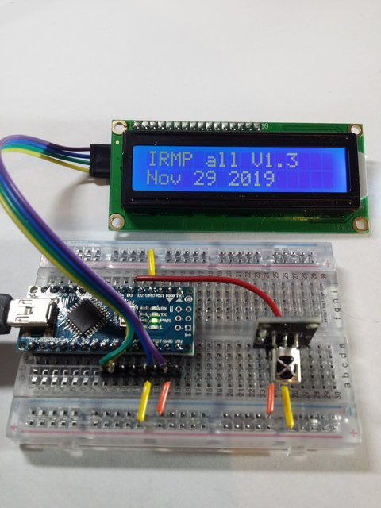 | 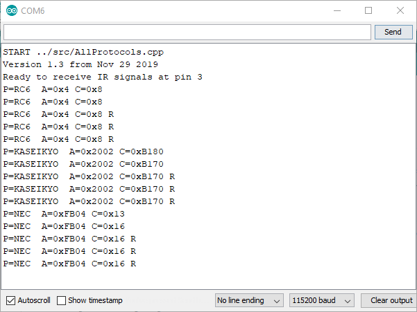 |

## Sample Protocols
| | | | |
|-|-|-|-|
| 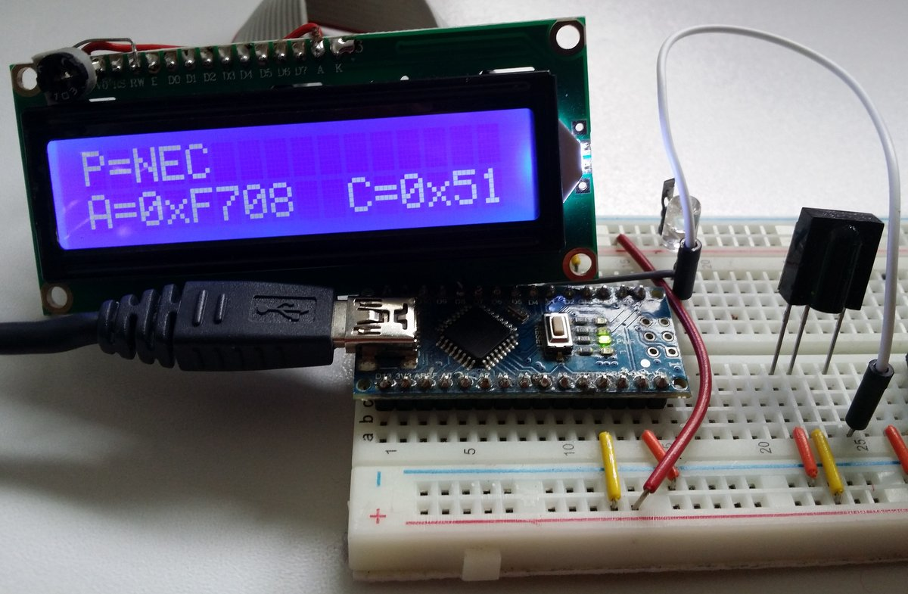| 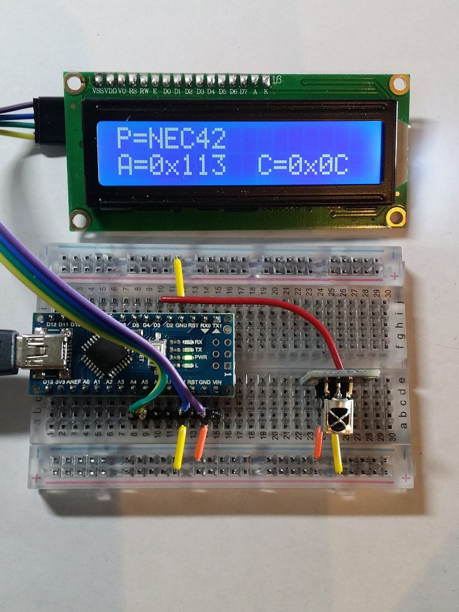 |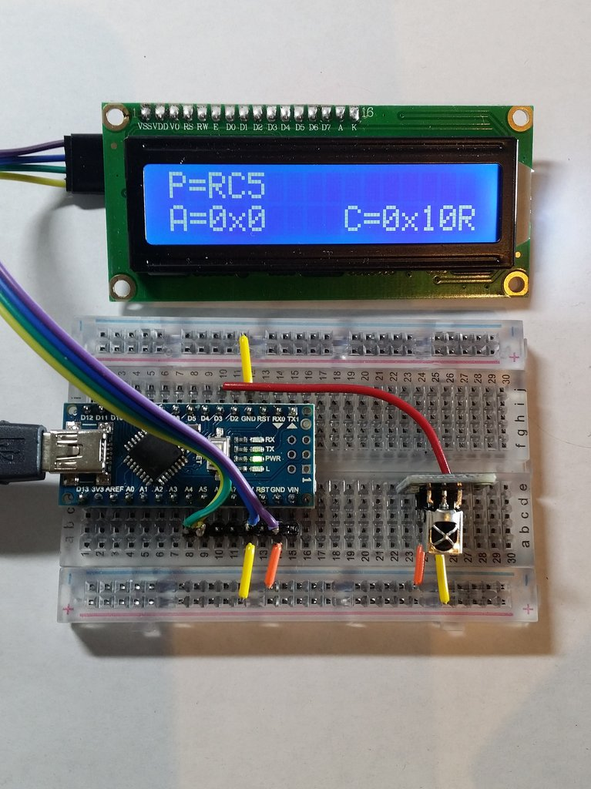 |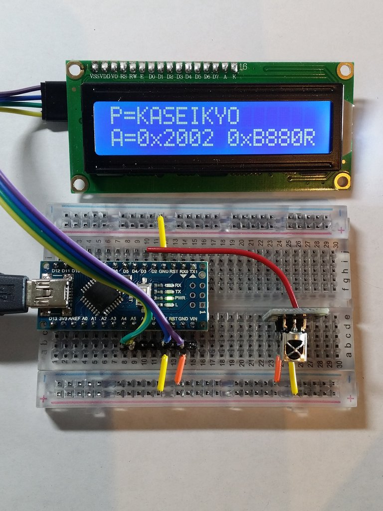 |
| 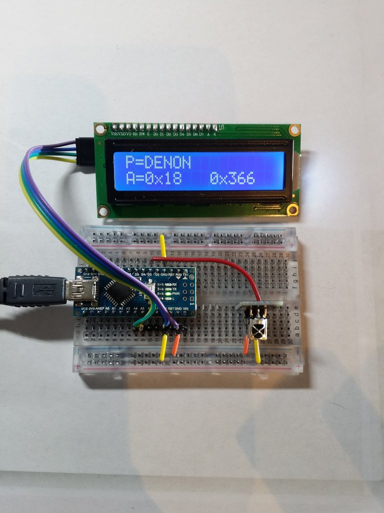 |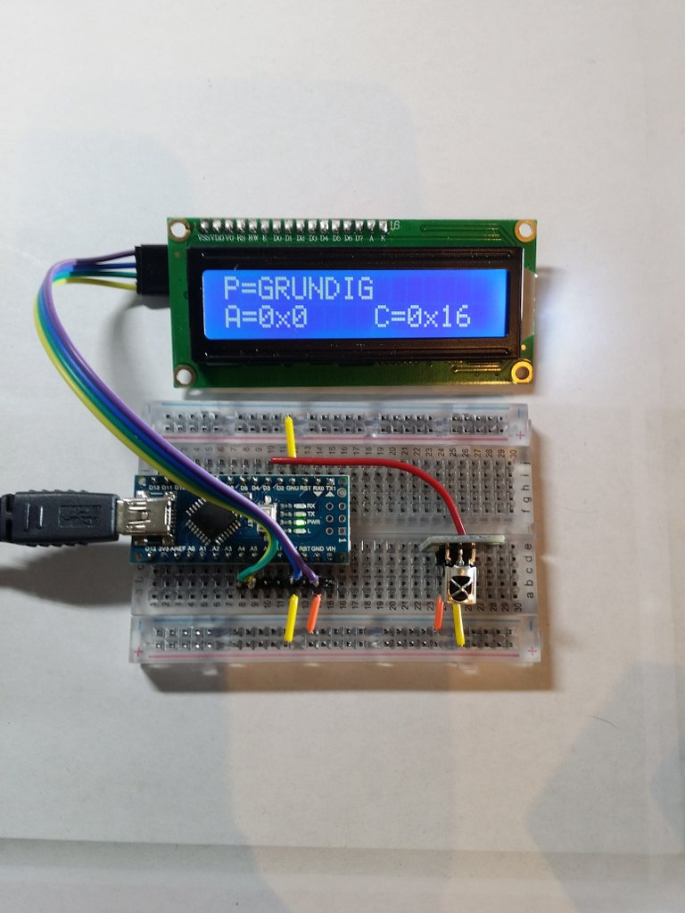 | |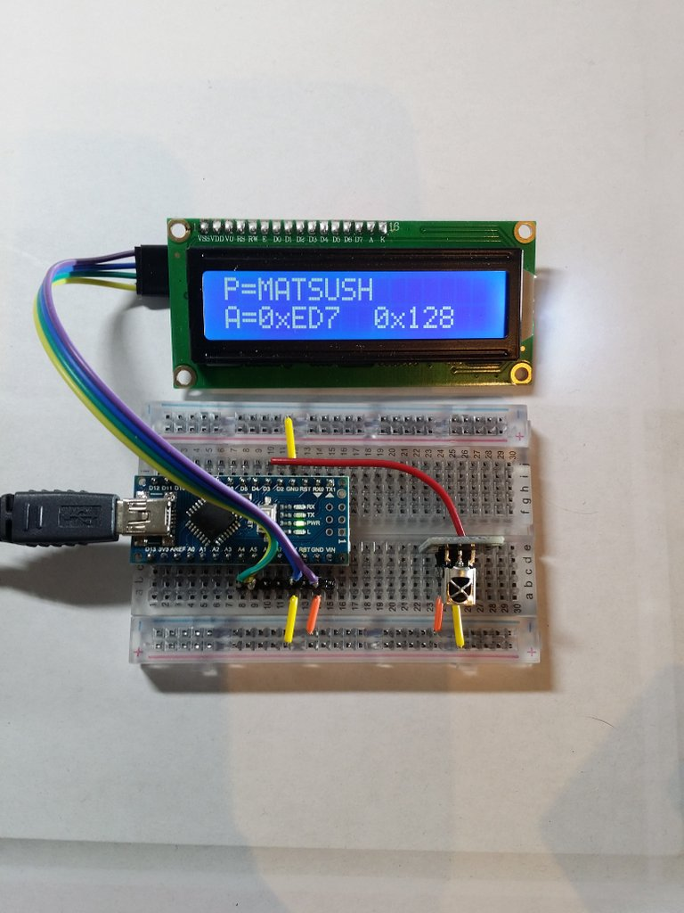 |
| 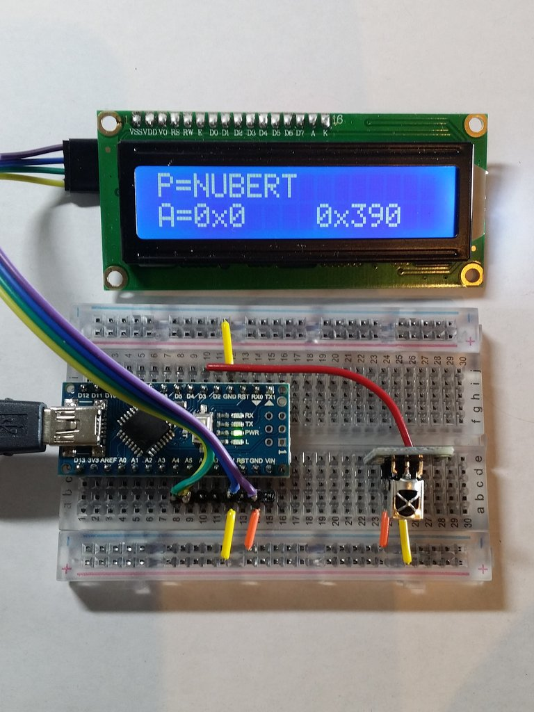 |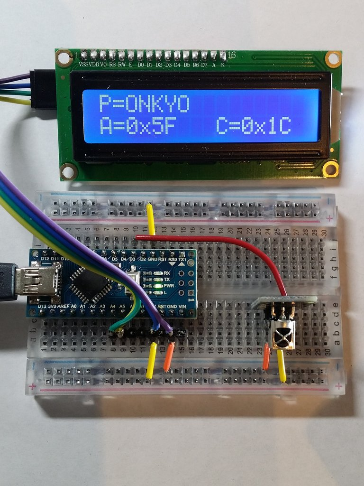 |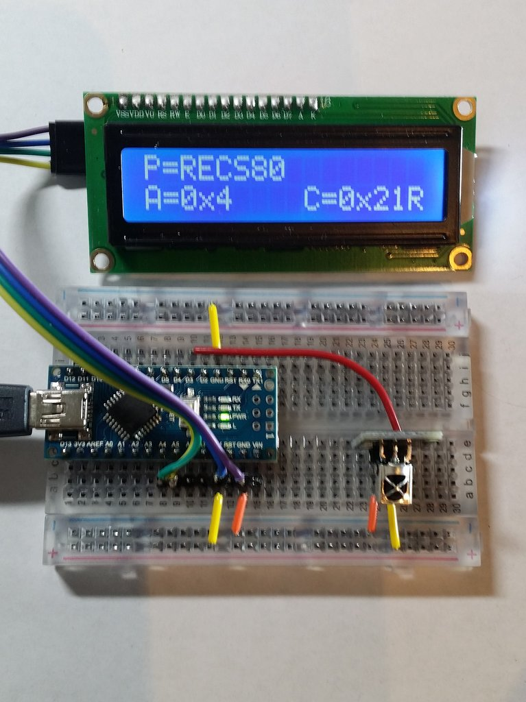 | |
| 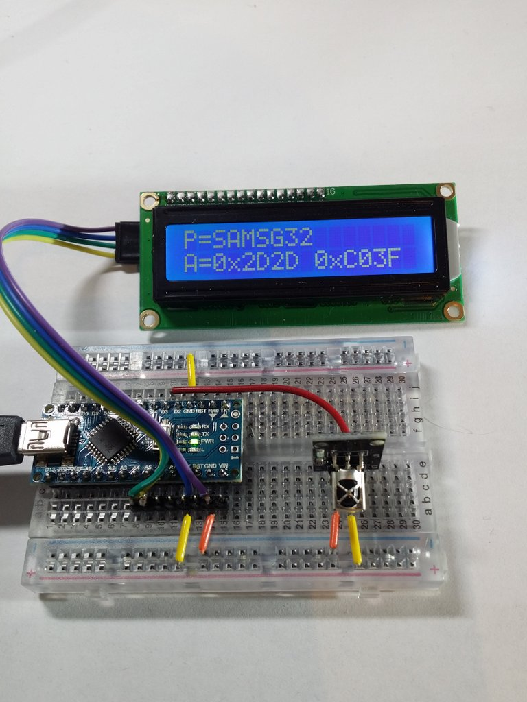 |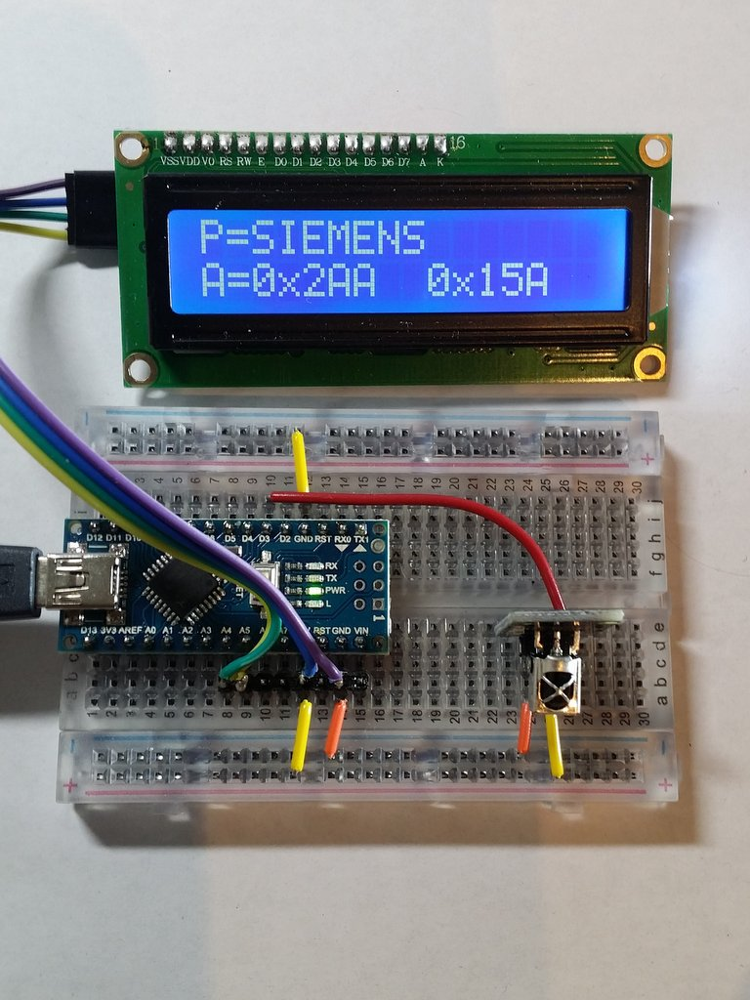 | | |


# Documentation at mikrocontroller.net
### English
   http://www.mikrocontroller.net/articles/IRMP_-_english<br/>
   http://www.mikrocontroller.net/articles/IRSND_-_english
### German
   http://www.mikrocontroller.net/articles/IRMP<br/>
   http://www.mikrocontroller.net/articles/IRSND

# Revision History
### Version 3.3.6 - work in progress

### Version 3.3.5
- Added TinyIRReceiver and updated IRDispatcherDemo examples.
- Fixed "enabling OUTPUT for dynamic pin" bug.
- Improved Apollo3 and MegaCore support.

### Version 3.3.4
- Removed convenience function `irmp_tone()`, since it statically allocates the tone interrupt vector.

### Version 3.3.3
- Added ATmega8 support.
- Added `IRSND_GENERATE_NO_SEND_RF` compile switch.
- Added function `irsnd_data_print()`.
- New SendAllProtocols example.
- New DispatcherDemo example.
- Added `IRMP_FEEDBACK_LED_PIN` compile switch.
- Removed `IRMP16` protocol from the all list.
- Added missing Leonardo support.

### Version 3.3.2
- Added missing Medion entry in `irmp_protocol_names`.
- Added function `irmp_print_protocol_name()`.
- Added Teensyduino support.
- Fixed macro redefinitions in IRSND.

### Version 3.3.1
- Fix for function `bool irmp_IsBusy()` if `IRMP_ENABLE_PIN_CHANGE_INTERRUPT` is defined.

### Version 3.3.0
- Added function `bool irmp_IsBusy()`.

### Version 3.2.3
- Fixed warning for missing `USE_ONE_TIMER_FOR_IRMP_AND_IRSND` macro.

### Version 3.2.2
- Removed blocking wait for ATmega32U4 Serial in examples.
- Restored missing line `reset interrupt flags` found by user yumkam.
- Fixed bug for sending only on no AVR platforms.

### Version 3.2.1
- Fixed bug in feedback LED handling for dynamic pins for send and receive.
- Fixed wrong timer selection for STM32F1xx / ARDUINO_ARCH_STM32.

### Version 3.2.0
- MBED support for Arduino Nano 33 BLE.
- Added ARDUINO_ARCH_STM32 definition.
- Fixed ESP8266 wrong memcpy_p definition introduced in 3.0.0.

### Version 3.1.2
- Fixed interrupt mode bug introduced by merging upstream code for version 3.1.0.
- Fixed ESP8266 wrong memcpy_p definition introduced in 3.0.0. - Fix was not complete :-(. Use 3.2.0.

### Version 3.1.1
- Added `MinimalReceiver` example.

### Version 3.1.0
- Added RF_MEDION protocol
- IRAM attribute etc.
- Fixed bug irmp_init used instead of irsnd_init
- New function irmp_print_active_protocols().
- Use timer3 for ESP32.
- Fix missing check for LED pin == 0.
- Merged upstream v3.2.2 + IRMP_ENABLE_RELEASE_DETECTION.
- Dynamic pin for feedback LED added.

### Version 3.0.0
- Support of RF (433MHz) remotes. 2 protocols **Generic 24 bit format** and **X10 format** added.
- MegaAVR (ATmega4809) support.
- Added `IRMP_IRSND_ALLOW_DYNAMIC_PINS` and extended `irmp_init()` and `irsnd_init()`to allow input, output and LED feedback pin selection at runtime.
- Support more protocols simultaneously on 32 bit CPUs.
- Use same pin and enable flag for receive and send feedback LED.
- New function `irmp_print_active_protocols()`.

### Version 2.2.1
- Improved pin layout.
- Fixed bug with stm32duino 1.9.
- Version number.
- Blink13 -> LEDFeedback.

### Version 2.2.0
- Supported **Apollo3** platform.
- Fixed DigisparkPro bug.

### Version 2.1.0
- Supported **SAMD** platform.
- IRSND enabled for non AVR platforms.

### Version 2.0.0
- Added IR send fuctionality (IRSND).
- Use `TIMER2_COMPB_vect` to be compatible with tone library.
- No longer required to call initPCIInterrupt() manually if IRMP_ENABLE_PIN_CHANGE_INTERRUPT is set.
- Separated code for timer to IRTimer.cpp.h.
- Separated code for Pin change interrupt to irmpPinChangeInterrupt.cpp.h.
- Fixed wrong pin numbers for BluePill.

### Version 1.2.2
- Fixed bugs introduced in 1.2.1.
 
### Version 1.2.1
- Bug for AVR architecture fixed.
- ATtiny85 + ATtiny167 support for ATTinyCore and Digistump core.
- Support for "Generic STM32F1 series" from "STM32 Boards (selected from submenu)" of Arduino Board manager.

### Version 1.2.0 - This version contains a bug for the AVR architecture
- Added STM32 M3 (BluePill) support.

### Version 1.1.0
- Added functions `irmp_disable_timer_interrupt()` and `irmp_enable_timer_interrupt()`.
- Added function `irmp_result_print(Print *aSerial)`.
- Improved examples.

### Version 1.0.1
- Added ESP8266 + ESP32 support.

# CI
Since Travis CI is unreliable and slow (5 times slower), the library examples are now tested with GitHub Actions for the following boards:

- arduino:avr:uno
- arduino:avr:mega
- arduino:samd:arduino_zero_edbg
- digistump:avr:digispark-tiny16
- digistump:avr:digispark-pro (ATtiny167)
- ATTinyCore:avr:attinyx5:chip=85,clock=8internal
- esp8266:esp8266:huzzah:eesz=4M3M,xtal=80
- esp32:esp32:featheresp32:FlashFreq=80
- STM32:stm32:GenF1:pnum=BLUEPILL_F103C8

#### If you find this library useful, please give it a star.
